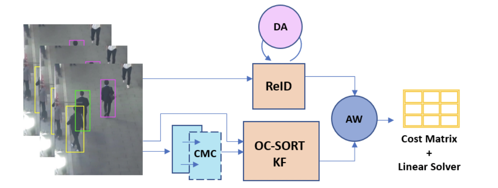

# Deep-OC-SORT

[](https://arxiv.org/abs/2302.11813) [](https://opensource.org/licenses/MIT) 


### Deep OC-SORT: Multi-Pedestrian Tracking by Adaptive Re-Identification [[arxiv]](https://arxiv.org/abs/2302.11813)
Gerard Maggiolino*, Adnan Ahmad*, Jinkun Cao, Kris Kitani (*=equal contribution)

<center>

</center>


| Dataset          | HOTA | AssA | IDF1 | MOTA  | IDs   | Frag   |
| ---------------- | ---- | ---- | ---- | ---- | ----- | ---- |
| MOT17 | 64.9 | 65.9 | 80.6 | 79.4 | 1,950 | 2,040  |
| MOT20 | 63.9 | 65.9 | 79.2 | 75.6 | 779  | 1,536  |

| Dataset          | HOTA | AssA | DetA | MOTA  | IDF1   |
| ---------------- | ---- | ---- | ---- | ---- | ----- | 
| DanceTrack | 61.3 | 45.8 | 82.2 | 92.3| 61.5 | 

* As of Mar 9th, 2023, Deep-OC-SORT ranks 1st compared to published methods on MOT17 and MOT20 w.r.t. HOTA. It improves tracking performance on DanceTrack over [OC-SORT](https://github.com/noahcao/OC_SORT) by ~6 HOTA.

## Installation

Tested with Python3.8 on Ubuntu 18.04. More versions will likely work.

After cloning, install external dependencies: 
```
cd external/YOLOX/
pip install -r requirements.txt && python setup.py develop
cd ../external/deep-person-reid/
pip install -r requirements.txt && python setup.py develop
cd ../external/fast_reid/
pip install -r docs/requirements.txt
```

OCSORT dependencies are included in the external dependencies. If you're unable to install `faiss-gpu` needed by `fast_reid`, 
`faiss-cpu` should be adequate. Check the external READMEs for any installation issues.

Add [the weights](https://drive.google.com/drive/folders/1cCOx_fadIOmeU4XRrHgQ_B5D7tEwJOPx?usp=sharing) to the 
`external/weights` directory (do NOT untar the `.pth.tar` YOLOX files).

## Data

Place MOT17/20 and DanceTrack under:

```
data
|——————mot (this is MOT17)
|        └——————train
|        └——————test
|——————MOT20
|        └——————train
|        └——————test
|——————dancetrack
|        └——————train
|        └——————test
|        └——————val
```

and run:

```
python3 data/tools/convert_mot17_to_coco.py
python3 data/tools/convert_mot20_to_coco.py
python3 data/tools/convert_dance_to_coco.py
```

## Evaluation


For the MOT17/20 and DanceTrack baseline:

```
exp=baseline
# Flags to disable all the new changes
python3 main.py --exp_name $exp --post --emb_off --cmc_off --aw_off --new_kf_off --grid_off --dataset mot17
python3 main.py --exp_name $exp --post --emb_off --cmc_off --aw_off --new_kf_off ---grid_off -dataset mot20 --track_thresh 0.4
python3 main.py --exp_name $exp --post --emb_off --cmc_off --aw_off --new_kf_off --grid_off --dataset dance --aspect_ratio_thresh 1000
```

This will cache detections under ./cache, speeding up future runs. This will create results at:

```
# For the standard results
results/trackers/<DATASET NAME>-val/$exp.
# For the results with post-processing linear interpolation
results/trackers/<DATASET NAME>-val/${exp}_post.
```

To run TrackEval for HOTA and Identity with linear post-processing on MOT17, run:

```bash
python3 external/TrackEval/scripts/run_mot_challenge.py \
  --SPLIT_TO_EVAL val \
  --METRICS HOTA Identity \
  --TRACKERS_TO_EVAL ${exp}_post \
  --GT_FOLDER results/gt/ \
  --TRACKERS_FOLDER results/trackers/ \
  --BENCHMARK MOT17
```

Replace that last argument with MOT17 / MOT20 / DANCE to evaluate those datasets.  

For the highest reported ablation results, run: 
```
exp=best_paper_ablations
python3 main.py --exp_name $exp --post --grid_off --new_kf_off --dataset mot17 --w_assoc_emb 0.75 --aw_param 0.5
python3 main.py --exp_name $exp --post --grid_off --new_kf_off --dataset mot20 --track_thresh 0.4 --w_assoc_emb 0.75 --aw_param 0.5
python3 main.py --exp_name $exp --post --grid_off --new_kf_off --dataset dance --aspect_ratio_thresh 1000 --w_assoc_emb 1.25 --aw_param 1
```

This will cache generated embeddings under ./cache/embeddings, speeding up future runs. Re-run the TrackEval script provided 
above.

You can achieve higher results on individual datasets with different parameters, but we kept them fairly consistent with round 
numbers to avoid over-tuning.

## Contributing

Formatted with `black --line-length=120 --exclude external .`

# Citation

If you find our work useful, please cite our paper: 
```
@article{maggiolino2023deep,
    title={Deep OC-SORT: Multi-Pedestrian Tracking by Adaptive Re-Identification}, 
    author={Maggiolino, Gerard and Ahmad, Adnan and Cao, Jinkun and Kitani, Kris},
    journal={arXiv preprint arXiv:2302.11813},
    year={2023},
}
```

Also see OC-SORT, which we base our work upon: 
```
@article{cao2022observation,
  title={Observation-centric sort: Rethinking sort for robust multi-object tracking},
  author={Cao, Jinkun and Weng, Xinshuo and Khirodkar, Rawal and Pang, Jiangmiao and Kitani, Kris},
  journal={arXiv preprint arXiv:2203.14360},
  year={2022}
}
```
